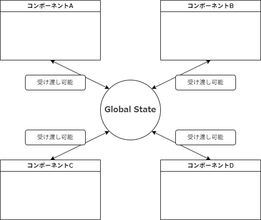

Jotai を利用した状態管理【個人学習まとめ】

学習中に使用した教材で状態管理ライブラリ Jotai を利用しました。
今回はそこで学んだ`atom`と`useAtom`について、学習した内容をまとめます。

##　 Jotai とは？
React 向けの状態管理ライブラリです。  
[Jotai](https://jotai.org/)

「状態」という単語と似ていいて親しみやすい名前だな～と思っていましが、どうやら本当に日本語の「状態」から名づけられているようです！(メイン開発者の方も日本の方でした。)

Jotai の基本構成は次のようなイメージになります。

- `atom`で状態（データ）を作成
- `useAtom`で状態を読む・書く
- カスタム Hook を作成して、状態と更新関数をまとめて管理

## 状態管理とは

コンポーネントがもつ**"今の状態"を管理する仕組み**です。  
そもそも「状態」とは何でしょうか？  
一言で表すと「アプリ内のすべてで共有されているデータ」と考えると分かりやすいです。
詳しい例だと

- ユーザーがログインしているかどうか
- ショッピングサイトのかごに商品がはいっているか など・・・
  フロントエンド(今回は React)で考えてみると**グローバルステート**にあたります。
  (反対に`useState`は限定されたスコープ内で使用するため、ローカスステートになります。)

グローバルステートであれば、どのコンポーネントからもステートを受け渡しすることができます。



しかし、ローカルステートで作成したステートを他のコンポーネントで利用したい場合は、コンポーネントからコンポーネントへ受け渡しをしなければなりません。2 つのコンポーネント間で受け渡しをすることはそこまで大変ではありませんが、2 つ、3 つと増えていった場合はどんどん複雑になります。(いわゆるバケツリレー形式)


できるだけ複雑な処理や管理を避けるためにも状態管理ライブラリを利用してみましょう！

##　インストール
React などを利用したことがある方であればおなじみのコマンドを利用します。

```
npm install jotai
```

## atom

では基本構成の`atom`についてです。  
`atom`は Jotai で状態管理をするための最小単位になります。

```ts
import { atom} from "jotai";

//初期値が空文字のatom
const sampleStrAtom = atom("");

intefase SampleType{
    id:number
    name:string
    isLogin:boolean
}


//型がsampleStrAtomのatom
const sampleObjAtom<SampleType>();
```

### useAtom

作成した`atom`をコンポーネント内で利用するためのフック(関数)です。
宣言する方法としては、React の`useState`と似ています。

```ts
const sampleStrAtom = atom("テストデータ");
const [value, setValue] = useAtom(sampleStrAtom);

console.log(value);
→ テストデータ

setValue("データ更新");
console.log(value);
→ データ更新

```

## 最後に

今回はここまでになります。Jotai のさわり部分だけになってしまったのが申し訳ないです。
学習を進めてさらに記事を作れたらと思います 💪💪

ここまでだけでも Redux と比べると分かりやすいな！と感じているところです。
また、日本語の記事も多くありよりとっかかりやすいですね。それではﾉｼ
