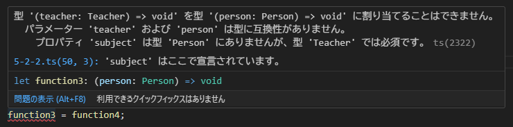
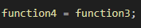

## 関数型の互換性(反変)

:::message alert
「互換性」ではなく「反変」が正しいです。
前回の記事[^1]に引き続き、私が学習に使っている本では「互換性」という表現を使用しているため、本記事でも同様に「互換性」という表現を使用します。
:::

前回の記事[^1]では戻り値の型に関する互換性(共変)を学習しました。
今度は引数の型について学習します。できるだけ単純にするために、**戻り値の型に互換性がある**と仮定して確認してみましょう。

### 引数の型

実際に確認する前に、引数の型となる 2 種類のインターフェイス`Person`と`Teacher`を定義します。

```ts
interface Person {
  name: string;
  age: number;
}

interface Teacher extends Person {
  subject: string;
}
```

`Teacher`インターフェイスは`Person`インターフェイスを拡張しています。
そのため、`Teacher`がもつプロパティは

- `name`
- `age`
- `subject`

の 3 つになり、**`Teacher`は`Person`のサブタイプ**という関係が成立します。

互換性を確認するために`function3`と`function4`という関数型の変数と確認用の引数を用意します。

```ts
let function3 = (person: Person) => {
  console.log("---- function3 ----");
  console.log(`名前:${person.name}`);
  console.log(`年齢:${person.age}`);
};

let function4 = (teacher: Teacher) => {
  console.log("---- function4 ----");
  console.log(`名前:${teacher.name}`);
  console.log(`年齢:${teacher.age}`);
  console.log(`部活:${teacher.subject}`);
};

//確認用の引数
const personTestData: Person = { name: "テスト太郎", age: 10 };
const teacherTestData: Teacher = {
  name: "先生 太郎",
  age: 20,
  subject: "国語",
};
```

`function3`の引数は`Person`型、`function4`の引数は`Teacher`型です。
それぞれ戻り値はありません。

これまでの学習から、`Person`型と`Teacher`型は互換性があるので`function3`に`function4`が代入できるのではないか？と思いますよね。試してみましょう。



エラーとなりました。なぜでしょうか？
`function3`は引数として`Person`型を受け取る関数ですが、実際には`function4`の引数`Teacher`型を受け取る必要があります。
そのため**`function4`では`Person`型には存在しない`subject`プロパティにアクセスを試みる**ことになりますが、`subject`プロパティが存在しないためエラーとなります。

では逆に`function4`に`function3`は代入できるのでしょうか。



エラー無く代入することができます。

`function4`に`function3`を代入後`function4`を呼び出す際には、引数として`Teacher`型のオブジェクトを渡す必要があります。
この時、`function4`には`function3`が代入されているため、実際には**`function3`に`Teacher`型の引数が渡され**実行されます。
`function3`に渡される引数`Teacher`には`function3`には必要のない`subject`プロパティが存在しますが、`function3`内部で`subject`にアクセスしていないため、無視されることになります。

### 余談

2 つの記事で関数の互換性(共変・反変)について学習しました。
自分なりにかみ砕いて説明したつもりですが、なかなか難しい内容になってしまいました。要改善な気がします・・・。
新たな発見にもつながるので、間違いがあればご指摘いただけるとありがたいです！

関数型の変数`function3`と`function4`を用意します。
引数はそれぞれ、

[^1]: [関数型の互換性(戻り値)【個人学習まとめ】](https://zenn.dev/o0rororo0o/articles/bcd8c173b80417)

関数代入時における括弧の有無による挙動の違い

写経中に関数の動きを確認したくて、次のようなコードを書きました。

```ts
let function1 = () => ({ name: "太郎" });
let function2 = () => ({ name: "次郎", age: 20 });
function1 = function2;
console.log(function1);
```

コンソールの結果は次のような想定をしていました。

```ts
name: "次郎", age: 20
```

しかし、実際の結果は私の想定と異なりました。

```ts
[Function: function2]
```

はて？となったので今更ながら調べ、主に 2 つのポイントがあることと私の間違いに気が付きました...。

### ポイント 1 afunction11 = afunction2 の意味

今回のコードをもう一度確認してみます。

```ts
let afunction1 = () => ({ name: "太郎" });
let bfunction2 = () => ({ name: "次郎", age: 20 });
afunction1 = bfunction2;
console.log(afunction1);
```

まず`function1 = function2;`部分ですが、これは`function1`という変数に`function2`の関数本体を代入していることを意味します。
この代入により、`function1`には**関数の実行結果ではなく、関数そのもの(() => ({ name: "次郎", age: 20 }))**が代入されました。

### ポイント 2 console.log(function1) の意味

次にコンソール部分を見てみましょう。

```ts
省略;
console.log(afunction1);
```

このコードは`function1`の中身を**そのまま出力する**コードです。
console.log で関数をそのまま出力する場合は、"[Function: 関数名]" の形式で表示し「これは関数ですよ」という情報を示してくれます。
今回の場合は`function1`には`function2`が代入されているので、コンソールには"[Function: function2]"と表示されます。

ここまできたらコンソールの結果が`[Function: function2]`となったことは理解できますね。

### 私の間違い

では、私が間違っていたのはどこだったのか確認していきましょう。
それは`let function1 = () => ({ name: "太郎" });`の挙動の理解が間違っていました。
私はこのコードを
**function1 に name: "太郎"というオブジェクトを代入している。**
という認識をしていました。
正しくは、**function1 に 関数を代入している**ということです。

なぜこの間違いをしていたのかよく考えてみると、

- アロー関数(() => {...})
- 関数を呼び出すまでは中身が実行されない
  この 2 点をよく理解していなかったことが判明しました。

今回の例を使いながら、上記 2 点を再度学習しました。
!!ここからはアロー関数の再学習の内容になります。必要のない方は読み飛ばしてください。

#### アロー関数

構文:`() => {...}`。
今回のコード`let function1 = () => ({ name: "太郎" });`は**function1 という引数無し関数を定義している**という意味になります。
JavaScript の`function`キーワードを使った次のコードと同等になります。

```ts
function function1() {
  return { name: "太郎" };
}
```

今回のアロー関数`() => ({ name: "太郎" })`では括弧をつかってオブジェクトを返しているため、オブジェクトが直接書かれているように見えました。
しかし、これは**関数が実行された時に返す値を示している**だけであり、変数`function1`にオブジェクトを定義しているわけではありません。

#### 関数を呼び出すまでは中身が実行されない

`function1`という変数は、代入した直後では**関数の定義そのものを保持**しています。
関数を実行しない限り、`{ name: "太郎" }`というオブジェクトは生成されません。

````ts
console.log(function1);  関数そのものが表示される
→ [Function: function1]
console.log(function1());  関数を実行し、オブジェクトが表示される
→ { name: '太郎' }


### 実際に想定していた結果を得るには？
私が当初想定していた結果をコンソールに出力してみましょう。
まずは私の想定をおさらいです。
```ts
name: "次郎", age: 20
````

これは関数の実行結果になるので、関数そのものを呼び出す必要があると分かりますね。

```ts
let afunction1 = () => ({ name: "太郎" });
let bfunction2 = () => ({ name: "次郎", age: 20 });
afunction1 = bfunction2;
console.log(afunction1());
→ { name: '次郎', age: 20 }
```

これでやりたかったことが実現できました。
JavaScript は括弧の使い分けが難しい...と感じました。
今回は非常に簡単なコードで気が付くことができたので、この機会に 1 つ 1 つ確実に定着させて将来困らないようにしましょう。
