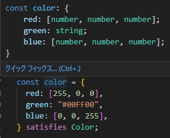

## 型ガード

前回までの記事では、型ガードの種類をいくつか確認しました。
今回の記事で引き続き型ガードについて学習していきましょう。

### タグ付きユニオン型による絞り込み

複数のオブジェクトから創成されたユニオン型(ことなる複数の型を組み合わせて新しい型を定義する)があるとき、各メンバーのプロパティに共通の識別子を与え、その識別子でオブジェクト型を判別することができます。

各メンバーが共通のタグをもつユニオン型型のことを**タグ付きユニオン型**という。
[ユニオン型(discriminated union)](https://typescriptbook.jp/reference/values-types-variables/discriminated-union#%E5%88%A4%E5%88%A5%E5%8F%AF%E8%83%BD%E3%81%AA%E3%83%A6%E3%83%8B%E3%82%AA%E3%83%B3%E5%9E%8B%E3%81%A8%E3%81%AF)

それでは実際のコードから確認してみましょう。
[前回の記事](https://zenn.dev/o0rororo0o/articles/7e4564553b06cf#in-%E6%BC%94%E7%AE%97%E5%AD%90%E3%81%AB%E3%82%88%E3%82%8B%E7%B5%9E%E3%82%8A%E8%BE%BC%E3%81%BF)で`in`演算子の確認のために利用したコードに、三角形の面積を求める処理を追加していきます。

三角形の面積を求めるにあたって追加する型は`Triangle`です。プロパティは`triangleBase`と`height`を持ちます。

新たな型を追加したのでユニオン型の`Shape`型を定義し、`getArea`関数の引数`shape`に`Shape`型を指定します。

```diff ts
interface Circle {
  radius: number;
}

interface Square {
  width: number;
  height: number;
}

const pi = 3.14;

+ interface Triangle {
+   triangleBase: number; //底辺の長さ
+   height: number;
+ }

+ type Shape = Circle | Square | Triangle;

function getArea(shape: Shape) {
+  if ("height" in shape) {
+    console.log("三角形の面積は・・・");
+    console.log((shape.triangleBase * shape.height) / 2);
+  }

  if ("radius" in shape) {
    console.log("円の面積は・・・");
    console.log(shape.radius * shape.radius * pi);
  } else {
    console.log("四角形の面積は・・・");
    console.log(shape.width * shape.height);
  }
}

const circleObject: Circle = { radius: 2 };
const squareObject: Square = { width: 3, height: 5 };
getArea(circleObject);
getArea(squareObject);
```

上記のコードでは

- 三角形の面積を求める処理
- 四角形の面積を求める処理
  の 2 か所でエラーになります。以下にエラー部分だけを抜粋し、エラーの内容も記載します。

```ts
  if ("height" in shape) {
    console.log("三角形の面積は・・・");
    console.log((shape.triangleBase * shape.height) / 2);
    → プロパティ 'triangleBase' は型 'Square | Triangle' に存在しません。
  プロパティ 'triangleBase' は型 'Square' に存在しません。
  }
　(省略)
  } else {
    console.log("四角形の面積は・・・");
    console.log(shape.width * shape.height);
    → プロパティ 'width' は型 'Square | Triangle' に存在しません。
  プロパティ 'width' は型 'Triangle' に存在しません。
  }
```

なぜこのようなエラーが発生したのでしょうか。
原因は`Square`型と`Triangle`型で同名のプロパティ`height`を持っているため、TypeScript が if 文の条件`"height" in shape`だけでは、`Square`型と`Triangle`型か区別出来ず型を絞り込むことができないからです。
そのため、三角形の面積を求めようとしても引数`shape`が`Square`の可能性があり、`triangleBase`が見つからないためエラーになります。
(四角形の面積を求めるときも同様に、引数`shape`が`Triangle`の可能性がある。という判断になります。)

仮に`Square`型に`triangleBase`プロパティを、`Triangle`型に`width`プロパティをそれぞれ追加した場合はエラーにはなりません。(今回のコードではどちらも面積を求めるには不要なプロパティなので追加しても意味はありません・・・)

このエラーを解決するために、`Triangle`型のプロパティ`height`を別名にすることで解決することができます。
しかし、型がどんどん増えていくにつれて各プロパティが重複しているかどうかなんて確認していられませんよね。そこでタグ付きのユニオン型の出番です。

前置きが長くなりましたがタグ付きのユニオン型はここからが本番です。

それぞれのに対して、共通のプロパティ`type`を追加します。これを「タグ」と呼びます。このタグはそれぞれの型を識別するために使用します。
さらに、`getArea`関数内の関数絞り込み部分を修正します。

```diff ts
interface Circle {
+  type: "circle";
  radius: number;
}

interface Square {
+  type: "square";
  width: number;
  height: number;
}

const pi = 3.14;

interface Triangle {
+  type: "Triangle";
  triangleBase: number; //底辺の長さ
  height: number;
}

type Shape = Circle | Square | Triangle;

function getArea(shape: Shape) {
+      switch (shape.type) {
+    case "triangle":
+      console.log("三角形の面積は・・・");
+      console.log((shape.triangleBase * shape.height) / 2);
+      break;
+    case "circle":
+      console.log("円の面積は・・・");
+      console.log(shape.radius * shape.radius * pi);
+      break;
+    case "square":
+      console.log("四角形の面積は・・・");
+      console.log(shape.width * shape.height);
+      break;
+  }
-  if ("height" in shape) {
-    console.log("三角形の面積は・・・");
-    console.log((shape.triangleBase * shape.height) / 2);
-  }
-  if ("radius" in shape) {
-    console.log("円の面積は・・・");
-    console.log(shape.radius * shape.radius * pi);
-  } else {
-    console.log("四角形の面積は・・・");
-    console.log(shape.width * shape.height);
-  }
}

+ const circleObject: Circle = { type: "circle", radius: 2 };
+ const squareObject: Square = { type: "square", width: 3, height: 5 };
+ const triangleObject: Triangle = {
+   type: "triangle",
+   triangleBase: 3,
+   height: 4,
+ };
- const circleObject: Circle = { radius: 2 };
- const squareObject: Square = { width: 3, height: 5 };
getArea(circleObject);
getArea(squareObject);
```

型の絞り込み方法を switch 文に変更しました。
この switch 文では`shape.type`に基づいて型を絞り込みます。

タグ付きユニオン型を導入したことにより、TypeScript は型を絞り込むことができるだけでなく、switch 文の case を入力する際にタグで自動補完機能を提供することができます。とてもかしこい。ありがとう。

### satisfies 演算子による型のチェック

`satisfies`演算子は変数宣言時に使える演算子で、宣言した変数が型を満たすかどうか検証します。

例を使って「宣言した変数が型を満たすかどうか」を確認してみましょう。

```ts
const color = {
  red: [255, 0, 0],
  green: "#00FF00",
  blu: [0, 0, 255],
};
```

上記のコードでは変数`color`のプロパティには三原色を表し、`number`型の配列か`string`型のカラーコードが値になります。
この変数`color`の型を TypeScript は次のように型推論します。

```ts
const color: {
  red: number[];
  green: string;
  blu: number[];
};
```

`number`型の`red`、`blu`プロパティに対しては`toFixed`メソッドを、`string`型の`green`プロパティに対しては`tolowerCase`メソッドを呼び出すことができます。

よく見てみると`blue`のスペルが`blu`とタイプミスをしていますね。このような間違いをなすためにも`Color`型を宣言してしまいましょう。

```diff ts
+ type RGB = [red: number, green: number, red: number];

+ interface Color {
+   red: RGB | string;
+   green: RGB | string;
+   blue: RGB | string;
+ }
```

`Color`の各プロパティの型は、`Tupple`型の`RGB`か`string`型のカラーコードです。
変数`color`にはに型注釈を行うことで、変数`color`に代入される値は`Color`型であることが決まりますね。コンソールで結果を確認してみましょう。

```diff ts
+ const color: Color = {
- const color = {
  red: [255, 0, 0],
  green: ,
+  blue: [0, 0, 255],
- blu: [0, 0, 255],
};

console.log(color.green.toLowerCase());
→ プロパティ 'toLowerCase' は型 'string | RGB' に存在しません。
  プロパティ 'toLowerCase' は型 'RGB' に存在しません。
```

`toLowerCase`メソッドでエラーとなりました。
型注釈を行わなかった時は、TypeScript が型推論を行っていたため`color.green`は`string`型であることが分かっていました。
しかし、`Color`型で型注釈を行ったため`string`型から`string | number`というユニオン型に上書きされてしまいました。そのため、`color.green`は`number`型である可能性もあるため、安全に`toLowerCase`メソッドを呼び出すことができなくなってしまいました。これが今
回エラーとなった原因です。

こういったエラーを回避するために`satishes`演算子があります。
実際のコードで確認してみましょう。

```ts
type RGB = [red: number, green: number, red: number];
interface Color {
  red: RGB | string;
  green: RGB | string;
  blue: RGB | string;
}

const color = {
  red: [255, 0, 0],
  green: "#00FF00",
  blue: [0, 0, 255],
} satisfies Color;
```

変数`color`を宣言し、初期化あとに`satisfies (型名)`をしています。
ここで、変数`color`の型推論はどうなっているか見てみると・・・



型推論の結果を維持していますね。これに加えて`Color`型との一致も検証できます。

これで`color.green`は型推論によって、`strin`型であると認識され`toLowerCase`メソッドを安全に呼び出すことができます。

```ts
console.log(color.green.toLowerCase());
→ #00ff00
```

また、プロパティ名が一致しない場合や

```ts
const wrongColor1 = {
  red: [255, 0, 0],
  green: "#00FF00",
  bl: [0, 0, 255],
  → オブジェクト リテラルは既知のプロパティのみ指定できます。'bl' は型 'Color' に存在しません。
} satisfies Color;
```

型`Color`に存在しないオブジェクトを指定すると「型不一致」のエラーになります。

```ts
const wrongColor2 = {
  red: [255, 0, 0],
  green: "#00FF00",
  blue: true,
  → 型 'boolean' を型 'string | RGB' に割り当てることはできません。ts(2322)
  5-4.ts(199, 3): 予期された型は、型 'Color' に対してここで宣言されたプロパティ 'blue' から取得されています
} satisfies Color;
```

---

ここまでで型ガードに関する学習はいったん終了になります。
もう少し言うと開発者が独自に関数を定義して、渡された値が特定の型かどうかチェックする
「[ユーザー定義の型ガード関](https://typescriptbook.jp/reference/functions/type-guard-functions#%E3%83%A6%E3%83%BC%E3%82%B6%E3%83%BC%E5%AE%9A%E7%BE%A9%E3%81%AE%E5%9E%8B%E3%82%AC%E3%83%BC%E3%83%89%E9%96%A2%E6%95%B0)」というものがありますが、今回はここまでとします。
TypeScirp は奥が深いですね・・・。
