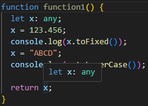
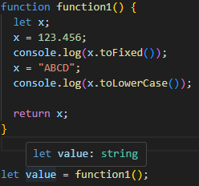

## ユーザー定義の型ガード関数(型述語)

### ユーザー定義の型ガード関数って？

開発者が独自に関数を定義して、その関数に渡された値が特定の型であるかどうかをチェックすることができます。
この関数のことをユーザー定義の型ガード関数と呼びます。
[型ガード関数](https://typescriptbook.jp/reference/functions/type-guard-functions)

ユーザー定義の型ガード関数を使わない型チェックとユーザー定義の型ガード関数を使った型チェックの両方から違いを確認してみましょう！

#### ユーザー定義の型ガード関数を使わない場合

まずはユーザー定義の型ガード関数を**使わない**場合です。

引数が`number`型かどうか判断する関数を準備します。`typeof`演算子を使用します。`typeof`演算子の戻り値は`Boolean`型でしたね。

```ts
function isNumber(value: unknown): boolean {
  return typeof value === "number";
}
```

次に異なるメソッドを呼び出して型チェックを行った結果を出力する関数を準備しますが・・・

```ts
function outValue(inputValue: number | string) {
  if (isNumber(inputValue)) {
    console.log(inputValue.toFixed());
    → プロパティ 'toFixed' は型 'string | number' に存在しません。
  プロパティ 'toFixed' は型 'string' に存在しません。
  } else {
    console.log(inputValue.toLowerCase());
    → プロパティ 'toLowerCase' は型 'string | number' に存在しません。
  プロパティ 'toLowerCase' は型 'number' に存在しません。
  }
}
```

`toFixed`メソッドと`toLowerCase`メソッドを呼び出す際にエラーとなりました。

`if (isString(inputValue)) {`部分だけで考えると、関数`isString`の戻り値は`Boolean`型なので、引数に`number`型を渡してあげれば`true`が帰ってくるので、if 文の判定は真となり問題なく`toFixed`メソッドを呼び出すことができそうですよね。

なぜこのような結果になったのでしょうか。

それは TypeScript が分かっているのは**関数`isString`の戻り値が`boolean`型である**ということだけだからです。関数`isString`で絞り込まれた型の情報は、関数`isString`のスコープから外れて瞬間に失われてしまうからです。

:::details 変数のスコープについてはこちら

簡単な例でその挙動を確認しましょう。

```ts
function function1() {
  let x: any;
  x = 123.456;
  console.log(x.toFixed());
  x = "ABCD";
  console.log(x.toLowerCase());

  return x;
}
```

上記のコードでは`any`型の変数`x`を返す関数`function1`を用意しました。
変数`x`を宣言時に初期化せずに宣言したので、値を代入しても変数`x`の型は`any`型に拡大されています。



しかし、この関数`function1`を外部から呼び出して変数`value`に代入してみると・・・



関数`function1`の戻り値が`string`型と推論されました。
これは関数`function1`で`return`する直前で変数`x`に、文字列`ABCD`を代入しているため、このような型推論が行われました。

では、最初のコードをもう一度確認しましょう。

```ts
//ユーザー定義の型ガード関数を使わない場合
function isNumber(value: unknown): boolean {
  return typeof value === "number";
}

function outValue(inputValue: number | string) {
  if (isNumber(inputValue)) {
    console.log(inputValue.toFixed());
    → toFixedメソッドを呼び出し時にエラー
  } else {
    console.log(inputValue.toLowerCase());
    → toLowerCaseメソッドを呼び出し時にエラー
  }
}
```

関数`isNumber`のスコープ内では、引数`value`が`number`型であることを TypeScript は分かっています。
しかし、関数`isNumber`のスコープを外れると、TypeScript は戻り値の`boolean`型であることしか分かりません。

よって、関数`outValue`内で型の安全性を保つことができないため、エラーが発生します。
:::

このような時にユーザー定義の型ガード関数を使って、**関数`isString`が型をチェックするための関数**であることを TypeScript に教えてあげることができます！

### ユーザー定義の型ガード関数を使う場合

ユーザー定義の型ガード関数を使う場合は、対象となる関数の戻り値の型を`(引数名) is (型名)`とすることによって指定できます。
(このことを[型述語](https://typescriptbook.jp/reference/functions/type-guard-functions#%E5%9E%8B%E8%BF%B0%E8%AA%9E)と呼びます。)

実際のコードで確認しましょう。

```ts
function isNumber(value: unknown): value is number {
  return typeof value === "number";
}

function outValue(inputValue: number | string) {
  if (isNumber(inputValue)) {
    console.log("number型です");
    console.log(inputValue.toFixed());
  } else {
    console.log("string型です");
    console.log(inputValue.toLowerCase());
  }
}
```

上記のコードでいうと、関数`isNumber`の戻り値部分`: value is number {`が該当します。
この関数が真の値を返した場合に、その引数が指定した型であることを TypeScript の型チェッカーに教えます。
今回でいうと「関数`isNumber`が`true`を返したら、引数`value`は`number`型である」ということになります。

このことから関数`outValue`内で関数`isNumber`が真として評価された場合は、TypeScript が引数`inputValue`は`number`型である！と理解し、`number`型のメソッドである`toFixed`メソッドを安全に呼び出すことができます。
if 文が偽となれば、引数`inputValue`は`string`型であることが分かるので、`string`型のメソッドである`toLowerCase`メソッドを安全に呼び出すことができます。

### 最後に

最後になってしまいましたが、TypeScript5.5 からは型述語を記述しないような関数でも型ガード関数として機能が発揮されるようになったようです！

```ts:サバイバルTypeScriptより抜粋
// 返り値の注釈がないこの関数は x is number という型述語で推論される
function noAnnotation(x: unknown) {
  return typeof x === "number";
}
```

記事を書いている時に見つけたので「読むのが遅かった～」という気持ちは出てきましたが、こういった歴史があった。ということを頭の片隅にあるとどこかで役に立つかもしれない！ということにして覚えておきたいですね！
最後までありがとうございました。それではﾉｼ
