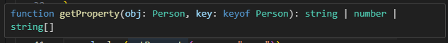

## ジェネリック型のルール

型引数`T`や`U`を用いることによって任意の型を受け入れる関数やクラスを作成する方法を学びました。  
しかし、関数やクラスの中で「この型だけ使いたい！」という場面が出てくることがあります。  
そのこでジェネリック型に制約(ルール)を設定する機能があります。学習してみましょう！

### `extends`による制約

冒頭では「ジェネリック型に制約(ルール)を設定する機能」と紹介しました。これは`extends`キーワードを使うことによって実装することができます。
構文は`(型引数名) extends 制約したい型名`となります。`extends`の後には`string`や`number`、`boolean`など任意の型を指定することができます。  
実際のコードで確認してみましょう。

```ts
class DataStorage<T extends number | string> {
  private items: T[] = [];

  add(item: T): void {
    this.items.push(item);
  }

  getItem(index: number): T {
    return this.items[index];
  }

  getAllItems(): T[] {
    return [...this.items];
  }
}
```

上記のコードでは`DataStorage`というジェネリッククラスに対して、**`number`型`string`型またはを受け付ける**という制約を設定しています。  
この`DataStorage`クラスをインスタンス化するときに、指定されていない型を`boolean`型を渡そうとすると・・・

```ts
let stringStorage = new DataStorage<boolean>();
→ 型 'boolean' は制約 'string | number' を満たしていません。
```

エラーが発生し、インスタンス化することはできません。  
これが`extends`による型の制約になります。

### `keyof`演算子との組み合わせ

`keyof`演算子と`extends`キーワードを組み合わせることによって、より強い型の制約を作ることができます。  
`keyof`演算子はオブジェクトからプロパティ名を取得することができます。([keyof 演算子について](https://zenn.dev/o0rororo0o/articles/1d08fa38d01615#keyof))

```ts
interface Person {
  name: string;
  age: number;
  hobbies: string[];
}

const parson: Person = {
  name: "○○ 先生",
  age: 20,
  hobbies: ["スポーツ観戦", "散歩"],
};

function getProperty(obj: Person, key: keyof Person) {
  return obj[key];
}

getProperty(parson, "name"); //name型を指定
```

上記のコードでは、`getProperty`関数で`Person`オブジェクトのプロパティから動的に型を取得し、引数の候補として選択できるようになります。単純に`string`や`number`と指定してもプロパティ名が`Person`インターフェイスのキーではない可能性があるためエラーになります。

この`getPropery`関数ですが、戻り値を確認してみると`string | number | string[]`と型推論されており、特定のキーにたいしてこれ！といった 1 つの型を返すような絞り込みはできていません。  


このような場合に`keyof`演算子と`extends`キーワードを用いたコードが活きていきます。

```ts
function getSpecificProperty<T, K extends keyof T>(obj: T, key: K) {
  return obj[key];
}

console.log(getSpecificProperty(parson, "name"));
```

関数に 2 つの引数`T`と`K`を指定しています。  
`K`には`extends keyof T`という制約が指定されていますね。これにより、**「K は T のキーのユニオン型のいずれかである」**ということが指定されます。  
以下では第二引数に`name`を指定しました。この状態で関数`getSpecificProperty`の戻り値を確認すると・・・

`string`に限定されています。

`keyof`演算子と`extends`キーワードを組み合わせ無かった場合は、ユニオン型で`string | number | string[]`となっていましたね。しかし、`K extends keyof T`という制約を付与することによって、`K`に渡される型が`T`に限定されるので、戻り値も`T`のいずれかだと特定されます。

---

記事、とてもよくまとまっています！特に、`extends` による基本的な型制約から `keyof` を用いた応用的な制約まで、段階を追って丁寧に解説されているので、初学者にも分かりやすい構成です。

では振り返りのために、この記事の内容に沿った実務寄りの練習問題を 3 問出題しますね。一問ずつ解いていきましょう！
