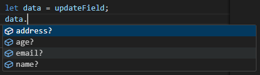

## ユーティリティ型

型を変換したり、新しい型を生成するために使用する組み込み式のジェネリック型が TypeScript には存在し、ユーティリティ型と呼びます。
いくつもの種類がありますが、今回は私が気になった 2 つの学習をしてみましょう！

### Partial<T>型

`Partial<T>`型は、指定された型のプロパティをオプショナルプロパティ(任意のプロパティ)に変換します。

例として、`User`インターフェイスを用意します。  
`age`、`address`はオプショナルプロパティで、省略しても OK なプロパティです。

```ts
interface User {
  name: string;
  email: string;
  age?: number;
  address?: string;
}
```

`User`インターフェイスを使用して、変数`user_1`を宣言し初期化します。

```ts
let user_1: User = {
  name: "○○",
  email: "abc_123@email.com",
  age: 20,
  address: "",
};
```

さらに、関数`updateUserInfo`を定義します。この関数の第二引数に`Partial`を適用します。

```ts
function updateUserInfo(user: User, updateField: Partial<User>) {
  return { ...user, ...updateField };
}
```

`Partial`を適用したことによって、関数`updateUserInfo`内では`User`インターフェイスすべてのプロパティがオプショナルプロパティになります。



これにより、`User`インターフェイスで必須のプロパティである`name`や`email`を指定せずとも、更新したいプロパティだけを更新できるようになりました。  
実際に更新してみましょう！

```ts
//更新前
→ { name: '○○', email: 'abc_123@email.com', age: 20, address: '' }

//emailだけ更新
user_1 = updateUserInfo(user_1, {
  email: "ABC_DEF@email.com",
});

console.log(user_1);
→ { name: '○○', email: 'ABC_DEF@email.com', age: 20, address: '' }

//addressだけ更新
user_1 = updateUserInfo(user_1, {
  address: "xx県",
});

console.log(user_1);
→ { name: '○○', email: 'ABC_DEF@email.com', age: 20, address: 'xx県' }
```

上記の例では、必須プロパティである`name`を指定しなくても`email`や`address`が更新できていることが確認出来ました。
`Partial`を利用せずに`user_1`の一部だけを更新使用とするとエラーになります。

```ts
function updateUserInfo2(user: User, updateField: User) {
  return { ...user, ...updateField };
}

//emailだけ更新
user_1 = updateUserInfo2(user_1, {
  email: "ABC_DEF@email.com",
  → 型 '{ email: string; }' の引数を型 'User' のパラメーターに割り当てることはできません。
  プロパティ 'name' は型 '{ email: string; }' にありませんが、型 'User' では必須です。
});

```

`Partial`を利用しない場合は、たとえ 1 部のプロパティだけを更新したい時でも、すべてのプロパティを記述する必要があります。

```ts

//emailだけ更新
user_1 = updateUserInfo2(user_1, {
  name: "○○",
  email: "abc_123@email.com",
  age: 20,
  address: "ABC_DEF@email.com",
});
→ エラーなし
```

### Record<Key,Type>型

キーの型が`Key`、値の型が`Type`であるオブジェクトを構成するためのユーティリティ型です。

```ts
type primaryColors = "red" | "green" | "blue";

let color: Record<primaryColors, string>;

color = {
  red: "FF0000",
  green: "00FF00",
  blue: "0000FF",
};
```

上記の例だと型が

- red
- green
- blue
  の 3 つになります。値は`string`型の`color`オブジェクトを定義しています。  
  ちなみに、型`primaryColors`に存在しないプロパティを定義しようとしてもエラーになります。

```ts
color = {
  red: "FF0000",
  green: "00FF00",
  blue: "0000FF",
  purple: "a260bf",
  → オブジェクト リテラルは既知のプロパティのみ指定できます。'purple' は型 'Record<primaryColors, string>' に存在しません
};
```

### Pick<T,Keys>型

既存の型`T`からいくつかのプロパティ`keys`を選択して、新しい型を構成するために使用されます。

```ts
interface User {
  name: string;
  email: string;
  age: number;
  address: string;
  birthdate: Date;
}

type Person = Pick<User, "name" | "age" | "birthdate">;

const teacher: Person = {
  name: "A先生",
  age: 30,
  birthdate: new Date("1995/10/10"),
};
```

上記の例では、`User`インターフェイスから`name`、`age`、`birthdate`プロパティのみを選択して、新しい`Person`という型を作成しています。  
変数`teacher`は新しく作成した`Person`型なので、`name`、`age`、`birthdate`のみを代入することができます。  
もちろん他のプロパティを代入することはできません。

```ts
const teacher: Person = {
  name: "A先生",
  age: 30,
  birthdate: new Date("1995/10/10"),
  email:"xxxxxx"
  → オブジェクト リテラルは既知のプロパティのみ指定できます。'email' は型 'Person' に存在しません。
};
```
